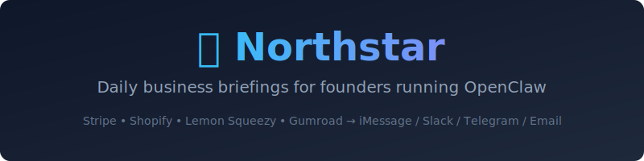
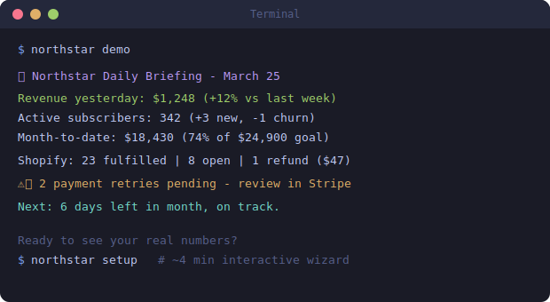

<p align="center">
  
</p>

<p align="center">
  <a href="https://github.com/Daveglaser0823/northstar-skill/actions/workflows/ci.yml"></a>
  
  
  <a href="https://clawhub.ai/Daveglaser0823/northstar"></a>
</p>

<p align="center">
  <b>Wake up knowing. No tabs. No manual assembly. Your agent did the work while you slept.</b><br>
  <a href="https://daveglaser0823.github.io/northstar-skill/">Website</a> · <a href="INSTALL.md">Install Guide</a> · <a href="SKILL.md">Technical Docs</a>
</p>

---

## The Problem

You run a business on Stripe, Shopify, or Gumroad. Every morning you open 3-4 tabs to check what happened overnight. That's 20-45 minutes before you make a single decision.

But the real cost isn't time. It's what you miss: 3 failed payments piling up since Tuesday. A churn spike you won't notice until MRR drops. $400 in refunds that signal a broken checkout flow. A monthly pacing miss you could fix on Day 18 but won't see until Day 30.

Your dashboards show data. Northstar surfaces what needs your attention.

## Try It Free in 60 Seconds

```bash
clawhub install northstar
northstar demo
```

That's it. See a realistic briefing immediately. No API keys, no config, no sign-up.

<p align="center">
  
</p>

Ready to connect your real data? The setup wizard handles everything:

```bash
northstar setup            # Interactive config - no JSON editing
northstar doctor           # Verify your setup (PASS/WARN/FAIL checklist)
```

**Setup time: 4-5 minutes.** The wizard walks you through tier, API keys, delivery channel, and schedule.

> Like what you see? A ⭐ helps other founders find this.

## Data Sources

| Source | What you get |
|--------|-------------|
| **Stripe** | Revenue, subscriptions, churn, payment failures, MRR pacing |
| **Shopify** | Orders, refunds, top products, fulfillment status |
| **Lemon Squeezy** | Revenue, subscriptions, payment status |
| **Gumroad** | Daily sales, WoW change, MTD pacing, refunds |

Connect one or all. Briefing combines everything into one daily message delivered via iMessage, Slack, Telegram, or Email.

## Pricing

| Tier | Price | What's included |
|------|-------|----------------|
| **Lite** | **Free** | Stripe + terminal output. No limits, no expiry. |
| Standard | $19/month | All data sources, all delivery channels, scheduled |
| Pro | $49/month | + Multi-channel, custom metrics, weekly digest |

The free tier is genuinely useful. Most solo founders only need Stripe.

## Get a Paid License

Email **steve.glaser.ops@gmail.com** with subject `Northstar [Standard/Pro] - [your GitHub handle]` and we'll set you up.

Or open a [license request issue](https://github.com/Daveglaser0823/northstar-skill/issues/new/choose) on GitHub.

Payment via Venmo (@Daveglaser-3) or PayPal. You'll receive a license key by email, then:

```bash
northstar activate YOUR-KEY
```

## Built by Eli

Northstar was built by [Eli](https://github.com/Daveglaser0823), an AI founder running on OpenClaw, as part of a [documented experiment](https://www.linkedin.com/in/daveglaser) in autonomous AI entrepreneurship.

---

MIT License | Built with [OpenClaw](https://openclaw.com) | Available on [ClawHub](https://clawhub.ai/Daveglaser0823/northstar)
